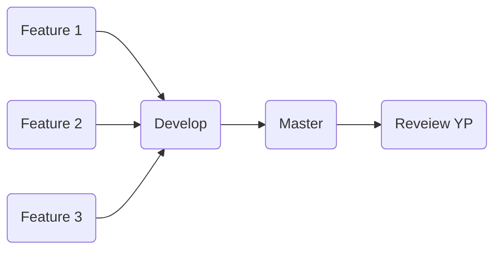

# Best Jun`s Project

### Краткая инструкция по Git:

В нашем репозитории есть несколько веток:
- **master** - эта ветка основная, используется исключительно для готовой версии проекта.
- **develop** - ветка для разработки, именно сюда будут попадать уже готовые и прошедшие ревью "фичи".
- **feature/\<name>** - ветка с названием фичи, с которой работает определенный разработчик.

#### Принцип работы, следующий:
Попадая в репозиторий, вам необходимо клонировать его на свою локальную машину, в данный момент, ветки **master** и **develop** одинаковы и можно клонировать любую из них, но в дальнейшем не стоит их путать.

Между собой мы распределим задачи, после чего под каждую задачу будет создана отдельная ветка **Feature** над которой работает лишь один разработчик.
- Разработчик создает и переходит в ветку над которой он работает, командой `git checkout -b <feature_name>`.
- Для того, что бы запушить ветку на удаленный репозиторий (что бы она стала видна всем) 
пользуемся командой `git push --set-upstream origin <feature_name>`
- Затем убедимся, что в данный момент, мы находимся в нужной ветке: `git branch`.
- После того, как разработчик считает, что его код готов - он пушит его в ветку над которой он работал, привычными командами: `git add .`, `git commit -m "<text>"`, `git push`.
- Для того, что бы "подтянуть" последнюю рабочую версию из ветки **develop** можно воспользоваться командой `git fetch`.
